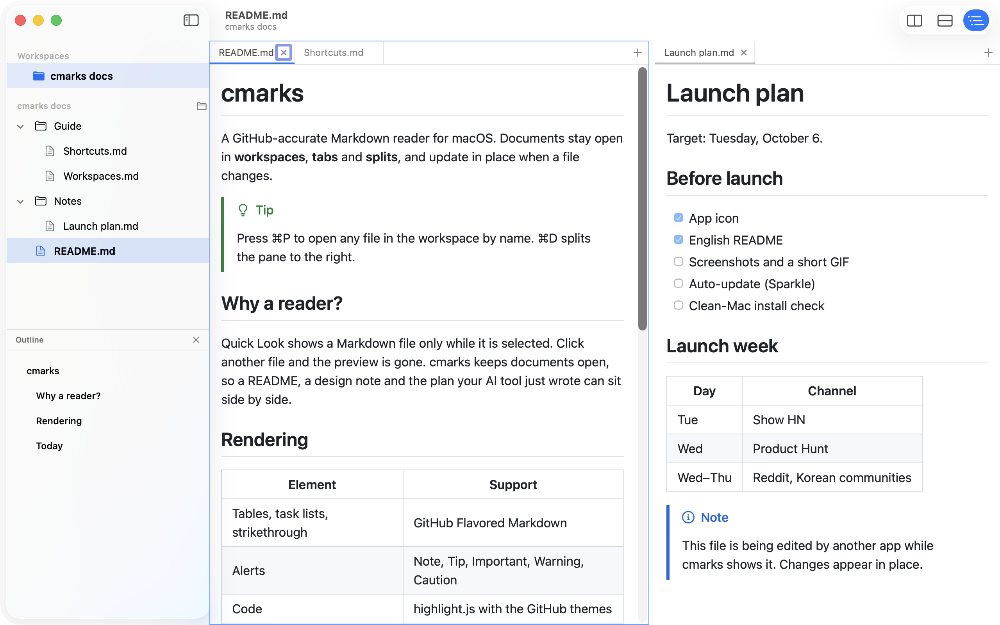
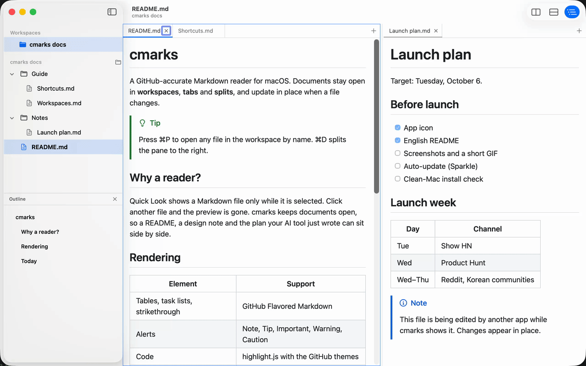

# cmarks

**A GitHub-accurate Markdown reader for macOS with workspaces, tabs and splits. It reads, it never edits.**

[](https://github.com/yuchanghyun/cmarks/releases/latest)
[](https://github.com/yuchanghyun/cmarks/actions/workflows/ci.yml)
[](#install)
[](LICENSE)

[한국어 README](README.ko.md)

<p align="center">
  <picture>
    <source media="(prefers-color-scheme: dark)" srcset="docs/images/dark.png">
    
  </picture>
</p>

## Why

Press Space on a Markdown file in the Finder and Quick Look shows it. Click another file or folder and the preview is gone. Quick Look only ever shows what is selected right now.

cmarks keeps documents open. Open a project folder as a workspace, read its documents in tabs, put two side by side, and when an editor or an AI coding tool rewrites a file, the view updates in place without losing your scroll position. There is no editing mode. It is built for reading.

## Features

- **Renders like GitHub.** Uses GitHub's own Markdown engine (cmark-gfm) and stylesheet: tables, task lists, strikethrough, footnotes, alerts (Note, Tip, Important, Warning, Caution), syntax highlighting, emoji shortcodes, math (KaTeX), Mermaid diagrams, heading anchors and front matter. Light and dark appearance follow the system.
- **Workspaces, tabs, splits and windows.** Folder-based workspaces, tabs per pane, split right or down, drag to resize, pane zoom, multiple windows and session restore. Keyboard layout matches [cmux](https://github.com/manaflow-ai/cmux).
- **Sidebar.** A file tree that follows file system changes, a document outline that highlights the current heading, and Quick Open (⌘P) with fuzzy matching.
- **Find in Workspace (⌘⇧F).** Full-text search across every Markdown file in the workspace, with file, line and context; open a match with the find bar on it.
- **Live reload.** Saving a file updates only the blocks that changed. Deleted or moved files are detected and picked up again when they reappear.

  
- **Reading tools.** Find, back and forward, zoom, print and export as PDF. ⌘-click a link to open it in a new tab, ⌥-click for a split.
- **Settings.** Toggle rendering extensions, choose the content width, define Markdown extensions and ignored folders, adjust behavior, and remap every keyboard shortcut.
- **Large documents.** Heavy post-processing is skipped above 2 MB. Above 5 MB only the beginning is shown until you choose Show All.
- **Quick Look.** Press Space on a Markdown file in the Finder and it renders the same way as in the app: highlighting, math, alerts, task lists, emoji and local images. (Mermaid diagrams show as code in Quick Look.)
- **Follow Finder Selection.** Turn it on in the View menu and cmarks shows whichever Markdown file you select in the Finder, like a Quick Look that never disappears.
- **Custom CSS** in Settings ▸ Appearance, and cmarks remembers where you were in each file.
- **Integration.** Finder "Open With", drag and drop, a `cmarks` command-line tool, `cmarks://open?path=` links and File ▸ Open Recent. The installer can make cmarks the default app for `.md` files.
- **English and Korean UI**, following the macOS system language.

## How it compares

cmarks is a reader, not an editor. It sits between Quick Look and a full editor.

| | cmarks | QLMarkdown | Marked 2 | Typora | Obsidian |
|---|---|---|---|---|---|
| What it is | Reader with workspaces | Quick Look extension | Preview app | Editor | Notes app |
| Keeps documents open in tabs and splits | ✓ | — | Windows only | Tabs | Tabs and panes |
| GitHub's own renderer (cmark-gfm) and stylesheet | ✓ | ✓ | GitHub style available | Own renderer | Own renderer |
| Live reload while another app edits the file | ✓ | — | ✓ | It is the editor | It is the editor |
| Quick Look extension included | ✓ | ✓ | — | — | — |
| Never modifies your files | ✓ | ✓ | ✓ | Edits | Edits |
| Price | Free | Free | Paid | Paid | Free for personal use |
| Open source | MIT | GPL | — | — | — |

Based on public product pages as of September 2026. Corrections are welcome as issues.

## Install

Requires macOS 15 Sequoia or later. Universal binary for Apple silicon and Intel. Builds are signed with a Developer ID and notarized by Apple.

**DMG**: download `cmarks-<version>.dmg` from [Releases](https://github.com/yuchanghyun/cmarks/releases/latest) and drag cmarks to Applications.

**Homebrew** (this repository is the tap):

```sh
brew tap yuchanghyun/cmarks https://github.com/yuchanghyun/cmarks
brew trust yuchanghyun/cmarks
brew install --cask cmarks
```

**Updates**: cmarks checks for a new version once a day and offers to install it (Sparkle). Turn it off in Settings ▸ Behavior ▸ Updates. Homebrew installs can also use `brew upgrade --cask cmarks`.

**From source**: Xcode 26 or later and `brew install xcodegen node pnpm`, then:

```sh
make assets    # bundle the web post-processing once
make run       # build and launch
make test      # Swift packages, web tests and app integration tests
make install   # copy to /Applications, install the cmarks CLI, offer to set cmarks as the .md default app
```

## Usage

- Open a file or folder with ⌘O, drag it onto the window, or run `cmarks README.md docs/` from a terminal. Folders become workspaces.
- Clicking a file in the tree opens a preview tab; double-click pins it. ⌘P opens any file in the workspace by fuzzy name.
- Split with ⌘D (right) or ⌘⇧D (down). Drag the divider to resize, double-click it to equalize.
- ⌘/ shows the full shortcut table inside the app.

### Default shortcuts

| Action | Shortcut |
|---|---|
| New workspace · New window · Workspace 1–8 · Last | ⌘N · ⌘⇧N · ⌘1–8 · ⌘9 |
| Quick Open · Open · Close Tab · Reopen Closed Tab | ⌘P · ⌘O · ⌘W · ⌘⇧T |
| Next · Previous tab | ⌘⇧] · ⌘⇧[ (⌃Tab · ⌃⇧Tab) |
| Split right · Split down · Toggle pane zoom | ⌘D · ⌘⇧D · ⌘⇧↩ |
| Focus pane · Resize pane | ⌥⌘ arrows · ⌃⌥⌘ arrows |
| Back · Forward · Reload | ⌘[ · ⌘] · ⌘R |
| Find · Find Next · Find Previous | ⌘F · ⌘G · ⌘⇧G |
| Find in Workspace | ⌘⇧F |
| Zoom In · Zoom Out · Actual Size | ⌘= · ⌘- · ⌘0 |
| Sidebar · Outline · Cycle appearance | ⌘B · ⌘⇧O · ⌥⌘T |
| Show in Finder · Open in External Editor | ⌥⌘R · ⌘⇧E |
| Print · Export as PDF | ⌥⌘P · ⌥⌘⇧P |

Every shortcut can be changed in Settings ▸ Shortcuts.

## Language

The interface is available in English and Korean and follows the macOS system language. To use a different language for cmarks only, add it under System Settings ▸ General ▸ Language & Region ▸ Applications.

## Known limitations

- Web links (http, https) always open in the default browser.
- Tabs cannot be dragged between windows yet.
- Quick Look shows Mermaid diagrams as code. If another Markdown Quick Look extension is installed (for example QLMarkdown), macOS uses only one of them; choose under System Settings ▸ General ▸ Login Items & Extensions ▸ Quick Look.
- Two `$` signs in one paragraph (for example `$5 and $10`) can be mistaken for math. Math can be turned off in Settings.

Changes are listed in [docs/RELEASE-NOTES.md](docs/RELEASE-NOTES.md) and on the [Releases](https://github.com/yuchanghyun/cmarks/releases) page.

## Development

A Swift 6 / SwiftUI app with three SwiftPM packages (rendering, layout, files) and an esbuild bundle for the in-page post-processing. The project file is generated with XcodeGen from `project.yml`. `make test` runs the Swift package tests, the web tests and the in-process app integration tests. Issues and pull requests are welcome.

## License

[MIT](LICENSE). Licenses of bundled third-party libraries are listed in [THIRD_PARTY_LICENSES.md](THIRD_PARTY_LICENSES.md).
