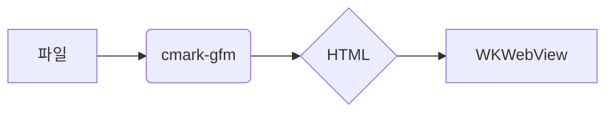

# cmarks 렌더링 점검 문서 edited

> 이 문서는 GitHub 스타일 렌더링의 모든 요소를 한 번에 확인하기 위한 픽스처입니다. QLMarkdown(GitHub 테마)과 나란히 놓고 비교하세요.

## 목차

- [헤딩](#헤딩)
- [텍스트 서식](#텍스트-서식)
- [목록](#목록)
- [표](#표)
- [코드](#코드)
- [알림](#알림)
- [이미지와 링크](#이미지와-링크)
- [수식](#수식)
- [다이어그램](#다이어그램)
- [각주와 HTML](#각주와-html)
- [🚀 이모지 헤딩](#-이모지-헤딩)
- [중복 헤딩](#헤딩-1)

## 헤딩

### 3단계 헤딩

#### 4단계 헤딩

##### 5단계 헤딩

###### 6단계 헤딩

## 헤딩

같은 이름의 두 번째 헤딩은 앵커가 `#헤딩-1`이 되어야 합니다.

## 텍스트 서식

**굵게**, _기울임_, **_둘 다_**, ~~취소선~~, `인라인 코드`, <kbd>⌘</kbd> + <kbd>D</kbd>, H<sub>2</sub>O, x<sup>2</sup>.

자동 링크: https://github.com/sbarex/QLMarkdown 와 www.example.com, 이메일 foo@example.com.

줄 끝 두 칸 공백 하드 브레이크  
다음 줄. "스마트 인용부호"는 변환하지 않습니다 -- 대시도 그대로.

## 목록

1. 첫째
2. 둘째
   1. 중첩 번호
   2. 중첩 번호
      - 3단계 불릿
3. 셋째

- [x] 완료한 일
- [ ] 남은 일
  - [ ] 중첩 태스크
- 일반 항목

## 표

| 왼쪽 정렬 |   가운데    | 오른쪽 |
| :-------- | :---------: | -----: |
| 셀        | **굵은 셀** |  1,234 |
| `code`    | [링크](#표) |   5.67 |

긴 표(가로 스크롤):

| c1                       | c2                       | c3                       | c4                       | c5                       | c6                       | c7                       | c8                       | c9                       | c10                       | c11                       | c12                       |
| ------------------------ | ------------------------ | ------------------------ | ------------------------ | ------------------------ | ------------------------ | ------------------------ | ------------------------ | ------------------------ | ------------------------- | ------------------------- | ------------------------- |
| 값 1                     | 값 2                     | 값 3                     | 값 4                     | 값 5                     | 값 6                     | 값 7                     | 값 8                     | 값 9                     | 값 10                     | 값 11                     | 값 12                     |
| 긴 내용 1 가나다라마바사 | 긴 내용 2 가나다라마바사 | 긴 내용 3 가나다라마바사 | 긴 내용 4 가나다라마바사 | 긴 내용 5 가나다라마바사 | 긴 내용 6 가나다라마바사 | 긴 내용 7 가나다라마바사 | 긴 내용 8 가나다라마바사 | 긴 내용 9 가나다라마바사 | 긴 내용 10 가나다라마바사 | 긴 내용 11 가나다라마바사 | 긴 내용 12 가나다라마바사 |

## 코드

```swift
struct Renderer {
    let options: Options
    func render(_ markdown: String) -> String { markdown }
}
```

```python
def hello(name: str) -> str:
    return f"hello {name}"
```

```bash
brew install xcodegen && make run
```

```json
{ "name": "cmarks", "version": "0.1.0" }
```

```yaml
name: cmarks
targets:
  cmarks:
    type: application
```

```diff
- old line
+ new line
```

```dockerfile
FROM swift:6.0
COPY . /app
RUN swift build -c release
```

```sql
SELECT id, title FROM docs WHERE lang = 'ko' ORDER BY id;
```

```typescript
export const slug = (s: string): string => s.toLowerCase();
```

```rust
fn main() {
    println!("hi");
}
```

```
언어 없는 코드 블록은 하이라이팅하지 않습니다.
```

```unknownlang
알 수 없는 언어도 그대로 표시합니다.
```

## 알림

> [!NOTE]
> 참고 사항입니다.

> [!TIP]
> 팁입니다. **굵게**도 됩니다.

> [!IMPORTANT]
> 중요합니다.

> [!WARNING]
> 경고입니다.

> [!CAUTION]
> 주의하세요.

> 일반 인용은 그대로 인용으로 남습니다.

## 이미지와 링크

상대 경로 이미지: 

원격 이미지: 

- 상대 링크: [하위 문서](sub/linked.md)
- 앵커가 있는 상대 링크: [하위 문서의 둘째 절](sub/linked.md#둘째-절)
- 외부 링크: [Apple](https://www.apple.com)
- 같은 문서 앵커: [표로 이동](#표)
- 로컬 비마크다운 파일: [샘플 이미지 파일](images/sample.png)

## 수식

인라인 $E = mc^2$ 와 블록:

$$
\int_0^\infty e^{-x^2}\, dx = \frac{\sqrt{\pi}}{2}
$$

```math
\sum_{i=1}^{n} i = \frac{n(n+1)}{2}
```

## 다이어그램



## 각주와 HTML

각주 예시[^1]와 두 번째 각주[^note].

<details>
<summary>펼쳐 보기</summary>

숨겨진 내용입니다. **마크다운**도 렌더링됩니다.

</details>

<script>alert("이 스크립트는 tagfilter로 이스케이프되어 실행되지 않습니다")</script>

<p align="center">가운데 정렬된 HTML 단락</p>

## 🚀 이모지 헤딩

숏코드 :rocket: :tada: :white_check_mark: :kr: 와 코드 안의 `:smile:`은 그대로.

[^1]: 첫 각주 내용.

[^note]: 이름 있는 각주.
